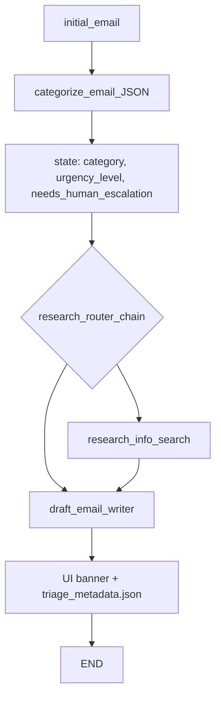

# AI Email Reply Agent

A Streamlit application that automatically processes and generates responses to customer emails using AI. The app uses [LangChain](https://python.langchain.com/) and [Groq](https://groq.com/) for natural language processing and understanding.

## Key Features

- **Email Categorization**: Automatically categorizes emails into specific categories like price inquiries, customer complaints, product inquiries, customer feedback, and off-topic emails.
- **Automatic Research**: Performs web searches for complex queries or specific product details using the Tavily API.
- **Professional Response Generation**: Generates tailored, professional email responses using the Groq API.
- **Streamlit Interface**: A user-friendly web interface to input email content, view categorization, see research, and generate responses in real-time.
- **Urgency & Sentiment Triage**: Evaluates emotional state and urgency during categorization, surfacing escalation flags for human review.

## System Logic

The agent treats the LLM as a **deterministic service** by enforcing structured JSON at each pipeline stage. Triage (urgency + intent) is separated from action (draft generation), enabling modular, production-ready workflows.

### Triage-First Design

Categorization no longer returns free text. The `EMAIL_CATEGORIZER_PROMPT` outputs structured JSON:

```json
{
  "category": "customer_complaint",
  "urgency_level": "high",
  "needs_human_escalation": true,
  "reasoning": "Customer reports billing blocked with frustrated tone"
}
```

### Urgency Schema

| Field | Type | Purpose |
|-------|------|---------|
| `urgency_level` | `"high"` \| `"low"` | Signals priority for backend routing |
| `needs_human_escalation` | `boolean` | Triggers human-in-the-loop review |
| `reasoning` | `string` | Audit trail for escalation decisions |

**Escalation criteria:** high frustration, technical blocking, or immediate financial impact.

### Pipeline Flow



### Human-in-the-Loop

When `needs_human_escalation` is `true`:

1. The AI still generates a conciliatory draft with a mandatory escalation sentence.
2. The Streamlit UI displays a **human review required** warning banner.
3. Triage metadata is persisted to `outputs/<run>/triage_metadata.json` for audit.

This ensures AI handles routine responses while critical situations are flagged for human empathy and judgment.

## Technical Challenges & Solutions

### Dependency and Import Errors

**Challenge:** The project listed split LangChain packages (`langchain-core`, `langchain-community`) in `requirements.txt`, but `processors.py` imported `Document` from the monolithic `langchain` package, causing `ModuleNotFoundError` at startup.

**Solution:** Migrated to `from langchain_core.documents import Document`, aligning imports with the installed dependency stack and reducing unnecessary package overhead.

### API Key Initialization Crashes

**Challenge:** `ChatGroq` was instantiated at module import time in `chains.py`. If `.env` was missing, empty, or loaded from the wrong working directory, the entire Streamlit app crashed before rendering any UI.

**Solution:** Implemented a `LazyChain` wrapper and `get_groq_llm()` factory in `src/chains.py` so API keys are validated only at runtime. Combined with explicit `.env` loading from the project root in `src/config.py` and startup validation in `app.py`, failures now surface as user-friendly error messages instead of tracebacks.

### Model Deprecation

**Challenge:** Groq decommissioned `llama3-70b-8192`, returning `400 model_decommissioned` errors on every LLM call.

**Solution:** Proactively migrated to `llama-3.3-70b-versatile` (Groq's recommended replacement) and centralized model configuration in `src/config.py` for straightforward future updates.

## Project Structure

- **`src/`**: Contains the main application code
  - `chains.py`: Logic for categorizing emails, conducting research, and generating responses.
  - `config.py`: Configuration and environment variable loading.
  - `processors.py`: Functions for processing emails, performing research, and drafting responses.
  - `prompts.py`: Templates used for AI prompt generation.
  - `state.py`: State management for the email processing workflow.
  - `workflow.py`: Defines the workflow using state graphs for processing emails.
- **`utils/`**: Utility functions for file operations and other helper tasks.
- **`outputs/`**: Stores generated response files like email drafts and research info.
- **`.env`**: Environment variables for API keys (Groq, Tavily).

## Setup

1. Clone the repository

   ```bash
   git clone https://github.com/Bhavik-Jikadara/AI-Email-Reply-Agent.git
   cd AI-Email-Reply-Agent
   ```

2. Create a virtualenv (windows user)

    ```bash
    pip install virtualenv
    virtualenv venv
    
    # windows users
    source venv/Scripts/activate
    
    # mac users
    source venv/bin/activate
    ```

3. Install dependencies:

   ```bash
   pip install -r requirements.txt
   ```

4. Create a .env file with your API keys:
   - [GROQ_API_KEY](https://console.groq.com/keys)
   - [TAVILY_API_KEY](https://app.tavily.com/)

   ```bash
   GROQ_API_KEY=your_groq_api_key
   TAVILY_API_KEY=your_tavily_api_key
   ```

5. Run the Streamlit app:

   ```bash
   streamlit run app.py
   ```

## Usage

1. Open the Streamlit app in your browser
2. Enter the email content in the text area
3. Click "Generate Response"
4. View the generated professional response

## License

[MIT](LICENSE)
